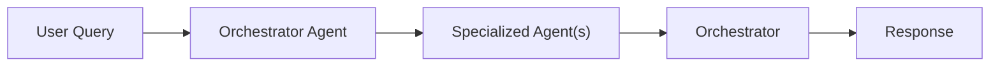
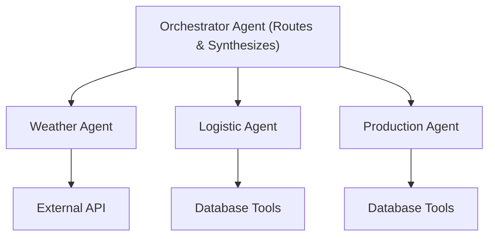
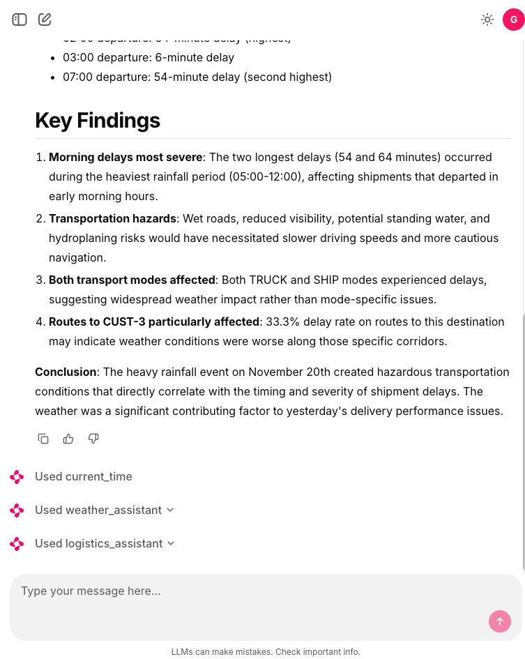

# Building scalable multi-purpose AI agents: Orchestrating Multi-Agent Systems with Strands Agents and Chainlit

We can build simple AI agents that handle specific tasks quite easily today. But what about building AI systems that can handle multiple domains effectively? One approach is to create a single monolithic agent that tries to do everything, but this quickly runs into problems of context pollution, maintenance complexity, and scaling limitations. In this article, we'll show a production-ready pattern for building multi-purpose AI systems using an **orchestrator architecture** that coordinates domain-specific agents.

The idea is simple: **Don't build one agent to rule them all** instead, create specialized agents that excel in their domains and coordinate them through an intelligent orchestrator. The solution is an **orchestrator agent** that routes requests to **specialized sub-agents**, each with focused expertise and dedicated tools. Think of it as a smart router that understands intent and delegates accordingly.

That's the core of the **Orchestrator Pattern** for multi-agent systems:



For our example we have three specialized agents:
1. **Weather Agent**: Expert in meteorological data and weather patterns. It uses external weather APIs to fetch historical and current weather data.
2. **Logistics Agent**: Specialist in supply chain and shipping operations. Fake logistics data is generated to simulate shipment tracking, route optimization, and delivery performance analysis.
3. **Production Agent**: Focused on manufacturing operations and production metrics. Also, fake production data is generated to analyze production KPIs.

That's the architecture in a nutshell:



The tech stack includes:

- **AWS Bedrock** with Claude 4.5 Sonnet for agent reasoning
- **Strands Agents** framework for agent orchestration
- **Chainlit** for the conversational UI
- **FastAPI** for the async backend
- **PostgreSQL** for storing conversation history and domain data

The orchestrator's job is simple but critical: understand the user's intent and route to the right specialist(s).

```python
MAIN_SYSTEM_PROMPT = """You are an intelligent orchestrator agent 
responsible for routing user requests to specialized sub-agents 
based on their domain expertise.

## Available Specialized Agents

### 1. Production Agent
**Domain**: Manufacturing operations, production metrics, quality control
**Handles**: Production KPIs, machine performance, downtime analysis

### 2. Logistics Agent
**Domain**: Supply chain, shipping, transportation operations
**Handles**: Shipment tracking, route optimization, delivery performance

### 3. Weather Agent
**Domain**: Meteorological data and weather patterns
**Handles**: Historical weather, atmospheric conditions, climate trends

## Your Decision Process
1. Analyze the request for key terms and domains
2. Determine scope (single vs multi-domain)
3. Route to appropriate agent(s)
4. Synthesize results when multiple agents are involved
"""
```

The orchestrator receives specialized agents as **tools**:

```python
def get_orchestrator_tools() -> List[Any]:
    from tools.logistics.agent import logistics_assistant
    from tools.production.agent import production_assistant
    from tools.weather.agent import weather_assistant

    tools = [
        calculator,
        think,
        current_time,
        AgentCoreCodeInterpreter(region=AWS_REGION).code_interpreter,
        logistics_assistant,  # Specialized agent as tool
        production_assistant,  # Specialized agent as tool
        weather_assistant     # Specialized agent as tool
    ]
    return tools
```

Each specialized agent follows a consistent pattern. Here's the weather agent:

```python
@tool
@stream_to_step("weather_assistant")
async def weather_assistant(query: str):
    """
    A research assistant specialized in weather topics with streaming support.
    """
    try:
        tools = [
            calculator,
            think,
            current_time,
            AgentCoreCodeInterpreter(region=AWS_REGION).code_interpreter
        ]
        # Domain-specific tools
        tools += WeatherTools(latitude=MY_LATITUDE, longitude=MY_LONGITUDE).get_tools()

        research_agent = get_agent(
            system_prompt=WEATHER_ASSISTANT_PROMPT,
            tools=tools
        )

        async for token in research_agent.stream_async(query):
            yield token

    except Exception as e:
        yield f"Error in research assistant: {str(e)}"
```

Each agent has access to domain-specific tools. For example, the weather agent uses external APIs:

```python
class WeatherTools:
    def __init__(self, latitude: float, longitude: float):
        self.latitude = latitude
        self.longitude = longitude

    def get_tools(self) -> List[tool]:
        @tool
        def get_hourly_weather_data(from_date: date, to_date: date) -> MeteoData:
            """Get hourly weather data for a specific date range."""
            url = (f"https://api.open-meteo.com/v1/forecast?"
                   f"latitude={self.latitude}&longitude={self.longitude}&"
                   f"hourly=temperature_2m,relative_humidity_2m...")
            response = requests.get(url)
            return parse_weather_response(response.json())
        
        return [get_hourly_weather_data]
```

The logistics and production agents use synthetic data generators for demonstration:

```python
class LogisticsTools:
    def get_tools(self) -> List[tool]:
        @tool
        def get_logistics_data(
            from_date: date,
            to_date: date,
            origins: Optional[List[str]] = None,
            destinations: Optional[List[str]] = None,
        ) -> LogisticsDataset:
            """Generate synthetic logistics shipment data."""
            # Generate realistic shipment data with delays, costs, routes
            records = generate_synthetic_shipments(...)
            return LogisticsDataset(records=records, aggregates=...)
        
        return [get_logistics_data]
```

For UI we're going to use [Chainlit](https://chainlit.io/). The Chainlit integration provides real-time visibility into agent execution:

```python
class LoggingHooks(HookProvider):
    async def before_tool(self, event: BeforeToolCallEvent) -> None:
        step = cl.Step(name=f"{event.tool_use['name']}", type="tool")
        await step.send()
        cl.user_session.set(f"step_{event.tool_use['name']}", step)

    async def after_tool(self, event: AfterToolCallEvent) -> None:
        step = cl.user_session.get(f"step_{event.tool_use['name']}")
        if step:
            await step.update()

@cl.on_message
async def handle_message(message: cl.Message):
    agent = cl.user_session.get("agent")
    message_history = cl.user_session.get("message_history")
    message_history.append({"role": "user", "content": message.content})
    
    response = await agent.run_async(message.content)
    await cl.Message(content=response).send()
```

This creates a transparent experience where users see:
- Which agent is handling their request
- What tools are being invoked
- Real-time streaming of responses

Now we can handle a variety of user queries:
For example:

**User**: "What was the average temperature last week?"

```
Flow:
1. Orchestrator identifies weather domain
2. Routes to weather_assistant
3. Weather agent calls get_hourly_weather_data
4. Analyzes and returns formatted response
```

Or multi-domain queries:

**User**: "Did weather conditions affect our shipment delays yesterday?"

```
Flow:
1. Orchestrator identifies weather + logistics domains
2. Routes to weather_assistant for climate data
3. Routes to logistics_assistant for shipment data
4. Synthesizes correlation analysis
5. Returns unified insight
```

And complex analytics:

**User**: "Analyze production efficiency trends and correlate with weather and logistics performance based in yesterday's data."

```
Flow:
1. Orchestrator coordinates all three agents
2. Production agent retrieves manufacturing KPIs
3. Weather agent provides environmental data
4. Logistics agent supplies delivery metrics
5. Orchestrator synthesizes multi-domain analysis
```

This architecture scales naturally in multiple dimensions. We can easily add new specialized agents without disrupting existing functionality. WE only need to create the new agent and register it as a tool with the orchestratortrator prompt with new domain description. That's it.

The orchestrator pattern transforms multi-domain AI from a monolithic challenge into a composable architecture. Each agent focuses on what it does best, while the orchestrator provides intelligent coordination.



In my point of view the strength of IA Agentes isn't building smarter monolith agents. The strength is building smarter teams of specialists.
